# WKT 销售管理系统 · 员工培训手册（图文版）

> **适用对象**：销售、计划、仓库、财务、外协跟单等参与正式测试的业务同事  
> **系统版本**：v0.6.0+（含库存、应收/应付、BOM 分析）  
> **简明版**：日常速查见 [`系统操作SOP.md`](./系统操作SOP.md)  
> **PDF 版**（打印 / 分发）：[`员工培训手册-图文版.pdf`](./员工培训手册-图文版.pdf)  
> 重新生成：`python scripts/export_sop_pdf.py`

---

## 如何使用本手册

| 符号 | 含义 |
|------|------|
| **步骤 1、2、3…** | 请严格按顺序操作 |
| ⚠️ **注意** | 误操作可能导致数据错误或无法保存 |
| 💡 **提示** | 提高效率的小技巧 |
| 🧪 **练习** | 正式测试阶段建议完成的实操任务 |
| 📷 **图** | 对应 `images/` 下截图；尚未配图处可先按文字操作 |

**建议学习顺序**：第 0 章 → 第 1 章（订单）→ 第 4 章（BOM，订单依赖）→ 第 5 章（库存）→ 第 2 章（对账）→ 第 3 章（客商档案）。

---

## 目录

1. [第 0 章 · 启动与界面](#第-0-章--启动与界面)
2. [第 1 章 · 订单管理](#第-1-章--订单管理)
3. [第 2 章 · 对账（应收 / 应付）](#第-2-章--对账应收--应付)
4. [第 3 章 · 客商信息维护](#第-3-章--客商信息维护)
5. [第 4 章 · BOM 分析](#第-4-章--bom-分析)
6. [第 5 章 · 库存](#第-5-章--库存)
7. [第 6 章 · 飞书通知（可选）](#第-6-章--飞书通知可选)
8. [第 7 章 · 正式测试检查表](#第-7-章--正式测试检查表)
9. [附录](#附录)

---

## 第 0 章 · 启动与界面

### 0.1 系统在哪里、数据存在哪

| 项目 | 说明 |
|------|------|
| 程序文件夹 | `P:\WKT`（或 IT 指定的共享路径） |
| 启动方式 | 双击 **`一键启动网页.bat`** |
| 访问地址 | 浏览器打开 **`http://127.0.0.1:5000`** |
| 数据文件 | `P:\WKT\data\wkt_orders.db`（SQLite，**重启后数据保留**） |
| 订单原件归档 | `P:\WKT\orders\客户名\`（OCR 成功后自动保存） |

⚠️ **注意**

- 启动后会出现 **黑色/蓝色命令行窗口**，**不要关闭**，关则网页无法使用。
- 多人测试时，每人电脑各跑一份，或按 IT 安排访问同一台服务器；**不要同时改同一条记录**。
- 数据库文件 **不要** 复制到 U 盘随意覆盖，以免冲掉他人数据。

📷 **图 0-1** · 启动脚本  
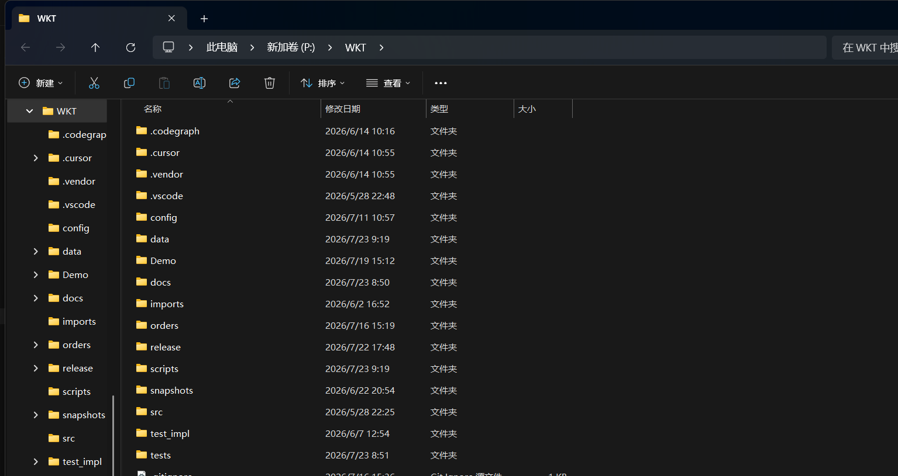

📷 **图 0-2** · 命令行窗口（须保持打开）  
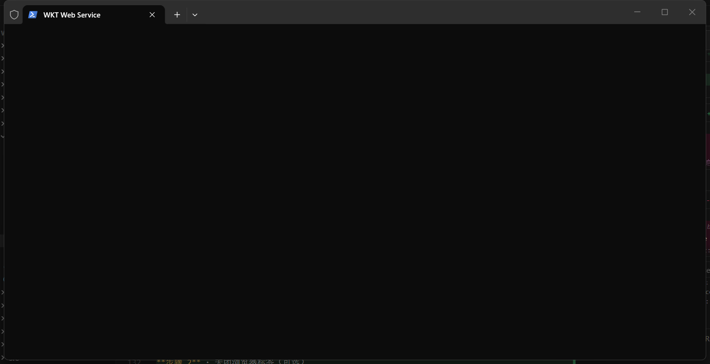

---

### 0.2 第一次打开 — 手把手步骤

**步骤 1** · 双击 `一键启动网页.bat`  
**步骤 2** · 等待约 5～15 秒，浏览器自动打开；若未打开，手动输入 `http://127.0.0.1:5000`  
**步骤 3** · 确认页面左上角为 **「WKT 销售管理系统」**，默认进入 **订单录入**  
**步骤 4** · 若页面样式异常或按钮无反应：按 **`Ctrl + F5`** 强制刷新

💡 **提示**：可让 IT 在浏览器收藏夹固定上述地址。

---

### 0.3 页面布局（上 · 中 · 下）

```
┌─────────────────────────────────────────────────────────────┐
│  WKT 销售管理系统    [订单管理▾][对账▾][客商▾][BOM▾][库存▾] │  ← 顶部导航
├─────────────────────────────────────────────────────────────┤
│                                                             │
│                    中间工作区（表格 / 表单）                  │
│                                                             │
├─────────────────────────────────────────────────────────────┤
│  页脚：当前模块标题 + 一行说明（随菜单切换自动变化）            │
└─────────────────────────────────────────────────────────────┘
```

📷 **图 0-3** · 顶部导航  
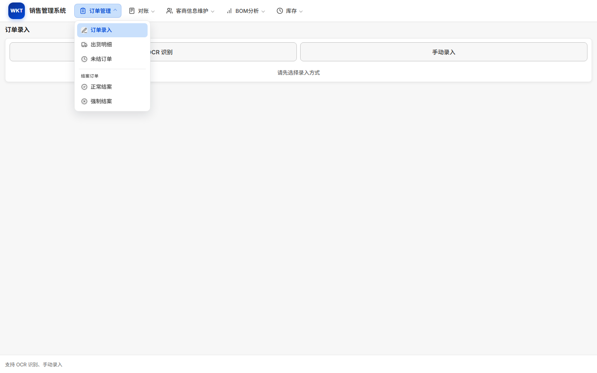

📷 **图 0-4** · 页脚说明  


---

### 0.4 顶部菜单一览

| 菜单 | 子功能 | 谁常用 |
|------|--------|--------|
| **订单管理** ▾ | 订单录入、出货明细、未结订单、正常结案、强制结案 | 销售、计划 |
| **对账** ▾ | 应收、应付 | 销售、财务 |
| **客商信息维护** ▾ | 客户信息维护、供应商信息维护 | 销售、采购 |
| **BOM分析** ▾ | BOM录入、BOM查询 | 工程、成本 |
| **库存** ▾ | 库存总览、工序出入库 | 仓库、计划 |

**步骤**：点击菜单名（如「订单管理」）→ 在下拉中点具体功能。

⚠️ **注意**：带 ▾ 的是下拉菜单，需 **再点一次** 子项才会跳转。

---

### 0.5 列表通用操作（所有表格适用）

几乎所有列表都支持：

| 功能 | 操作 |
|------|------|
| **列筛选** | 表头列名右侧 **▾** → 勾选要显示的值 → **确定** |
| **清空筛选** | 工具栏 **「清空筛选」** |
| **悬停提示** | 单元格文字被截断时，鼠标悬停看全文 |
| **滚动** | 表格区域可上下滚动；对账页为 **按月分段** 滚动浏览 |

📷 **图 0-5** · 列筛选面板  
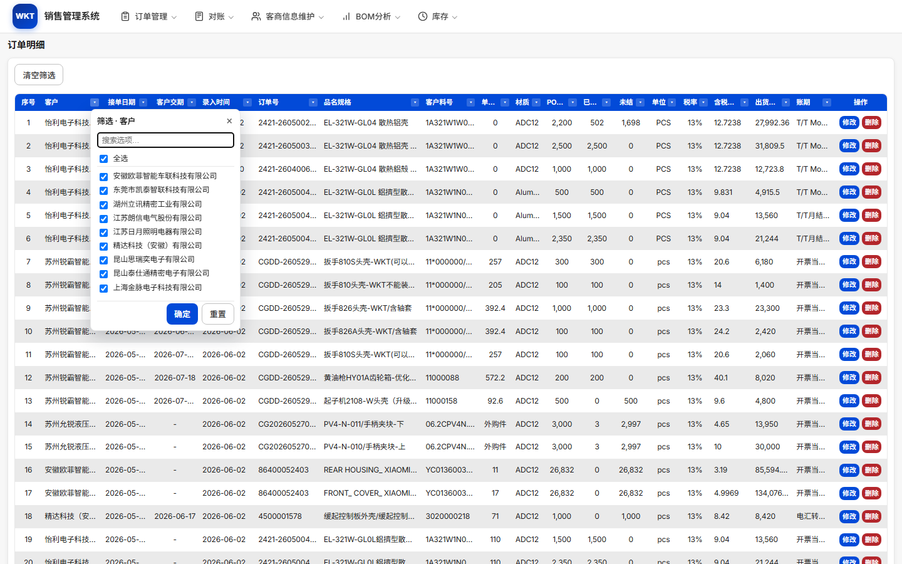

---

### 0.6 关闭系统

**步骤 1** · 保存当前正在编辑的内容  
**步骤 2** · 关闭浏览器标签（可选）  
**步骤 3** · 在启动时的 **命令行窗口** 按 `Ctrl + C`，或直接关闭该窗口  

下次使用重新双击 `一键启动网页.bat` 即可。

---

## 第 1 章 · 订单管理

订单是系统核心：**一料号一行**（15 列 RMB 口径）。同一客户、同一 PO、不同料号 = 多行。

### 1.1 业务流转总览

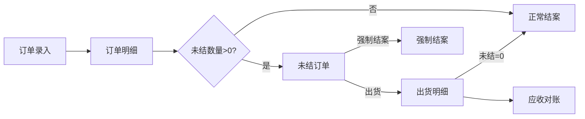
```mermaid
flowchart LR
  A[订单录入] --> B[订单明细]
  B --> C{未结数量>0?}
  C -->|是| D[未结订单]
  C -->|否| E[正常结案]
  D -->|出货| F[出货明细]
  F -->|未结=0| E
  D -->|强制结案| G[强制结案]
  F --> H[应收对账]
```

---

### 1.2 订单录入 · 选择方式

**进入路径**：顶部 **订单管理 ▾ → 订单录入**

页面最上方有两个模式按钮（Excel 导入当前版本默认隐藏）：

| 按钮 | 适用场景 |
|------|----------|
| **订单 OCR 识别** | 客户 PO 为 PDF、扫描件、照片 |
| **手动录入** | 少量补录、无电子版 PO |

未选择前，下方只有提示「请先选择录入方式」。

📷 **图 1-1**  


🧪 **练习**：分别点两个按钮，确认下方区域会切换。

---

### 1.3 方式 A · OCR 识别（逐步操作）

#### 适用

- 客户发来 PDF / 图片采购订单  
- 一行料号对应表格一行，识别后批量提交  

#### 操作步骤

**步骤 1** · 点 **「订单 OCR 识别」**  
**步骤 2** · 在 **「上传订单识别」** 区点 **选择文件**  
  - 支持：`.pdf`、`.png`、`.jpg` 等  
  - **可按住 Ctrl 多选** 多个文件  
**步骤 3** · 点 **「识别」**，等待进度条（多文件按顺序：OCR → AI 整理 → 规则校验）  
**步骤 4** · 识别成功后出现 **「识别预览」** 区域  

#### 预览区结构

| 区域 | 作用 |
|------|------|
| **上方 · 订单原件** | PDF 转 **200 DPI 高清图**；可 +/− 缩放、「适合宽度」、「新窗口打开」、「收起原件」 |
| **下方 · 识别表格** | 每料号一行；可直接改单元格 |
| **校验摘要** | 黄色 = 规则未通过，须核对 |

📷 **图 1-2** · 上传区  
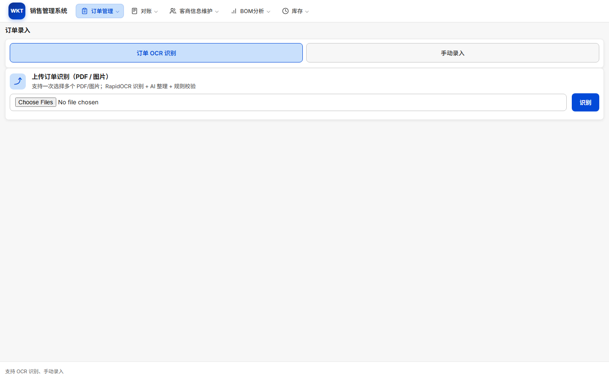

📷 **图 1-3** · 预览核对  
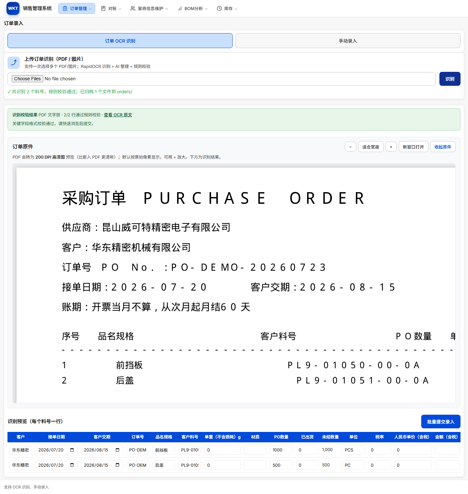

#### 重点核对项

| 列 | 说明 |
|----|------|
| 客户 | 是否与 PO 一致；简称可能需改全称 |
| 订单号 | PO 号 |
| 品名规格 / 客户料号 | 料号须在 BOM 已建档（见第 4 章） |
| PO数量 | 须 > 0 |
| 账期 | **自由文字**，按合同填写 |
| 人民币单价（含税） | 与 PO 一致 |

**步骤 5** · 改完黄标记行  
**步骤 6** · 点 **「批量提交录入」**  
**步骤 7** · 成功后自动跳转 **订单明细**，新行 **黄色高亮约 15 秒**

⚠️ **注意**

- **黄色格子** 未改完也可能提交失败或数据不准，务必对照原件。  
- 识别成功后会 **自动归档** 原文件到 `orders/客户名/`，文件名 `接单日期_订单号.pdf`。  
- 同一 **客户 + 订单号 + 品名规格** 不能重复新建，系统会拒绝并跳到已有行。

💡 **提示**

- 多文件时，用顶部下拉切换原件。  
- 可点 **「查看 OCR 原文」** 对照机器识别字。  
- **账期** 无固定下拉，OCR 识别什么就显示什么，可手改。

🧪 **练习**

1. 用 1 份测试 PO 完成识别 → 提交 → 在订单明细找到新行。  
2. 故意留一个黄标记，观察提交时的提示。

---

### 1.4 方式 B · 手动录入（逐步操作）

#### 操作步骤

**步骤 1** · 点 **「手动录入」**  
**步骤 2** · 填写表单（分三组）  

**第一组 · 订单基本信息**

| 字段 | 必填 | 说明 |
|------|:----:|------|
| 客户 | ✓ | 下拉选择；无则点 **+** 快速新增名称 |
| 接单日期 | ✓ | 本公司接单日期 |
| 客户交期 | | 客户要求交货日 |
| 订单号 | ✓ | 客户 PO 号 |
| 账期 | | 自由填写 |

**第二组 · 产品信息**

| 字段 | 必填 | 说明 |
|------|:----:|------|
| 品名规格 | ✓ | 下拉；**+** 仅新增品名选项，不建 BOM |
| 客户料号 | | 填写后 **离开输入框**，系统查 BOM 回填品名/单重/材质 |
| 单重（g） | | 数字或文字如「外购件」 |
| 材质 | | 如 ADC12 |
| PO数量 | ✓ | 须 > 0 |

**第三组 · 数量与价格**

| 字段 | 说明 |
|------|------|
| 已出货 | 新单填 **0** |
| 单位 | 如 PCS |
| 税率(%) | 如 13 |
| 人民币单价（含税） | 含税单价 |

**步骤 3** · 点 **「提交录入」**  
**步骤 4** · 需要重填时点 **「清空」**

📷 **图 1-4**  
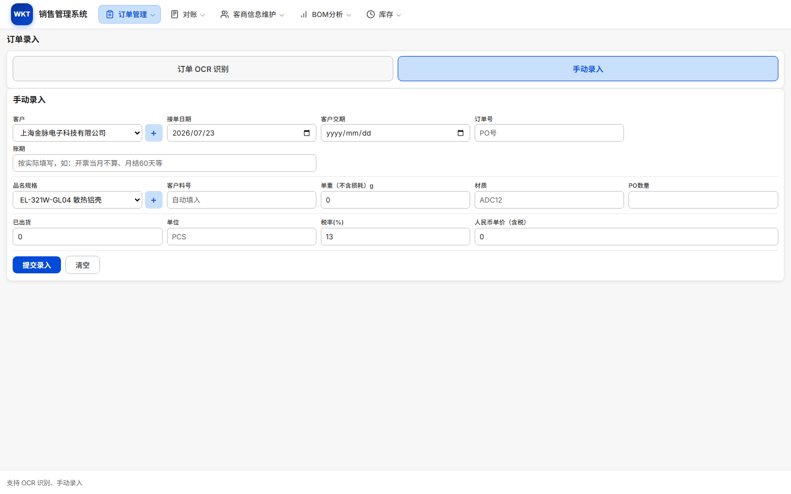

⚠️ **注意**

- 填写了 **客户料号** 时，须已在 **BOM录入** 建档且 **客户一致**，否则无法保存。  
- **未结数量** 系统自动算 = PO数量 − 已出货，**不要手填**。  
- **已出货** 不能 < 0 或 > PO数量。

🧪 **练习**：手动录入 1 条测试料号（先完成 BOM 建档）。

---

### 1.5 订单明细

**进入路径**：**订单管理 ▾ → 订单明细**（录入成功也会自动打开）

#### 能看到什么

全部料号行：客户、日期、订单号、品名、料号、PO、已出货、未结、单价、账期、**录入时间** 等。

#### 常用操作

| 操作 | 步骤 |
|------|------|
| **查找某客户** | 表头「客户」列 ▾ → 勾选客户 → 确定 |
| **修改** | 行末 **修改** → 行内编辑 → **保存** / **取消** |
| **删除** | **删除** → 确认（⚠️ 不可恢复，慎用） |

列表默认 **最新录入在最上**。

📷 **图 1-5**  
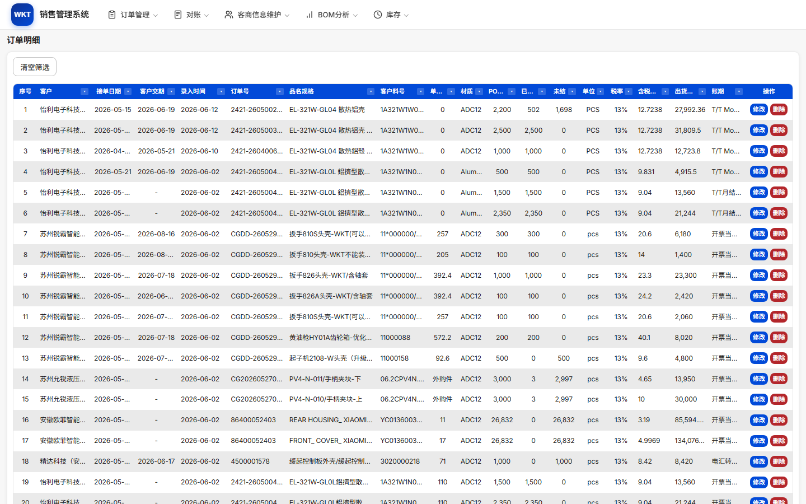

---

### 1.6 未结订单与出货

**进入路径**：**订单管理 ▾ → 未结订单**

只显示 **未结数量 > 0** 的行。

#### 交期颜色含义

| 颜色 | 含义 |
|------|------|
| **黄色背景** | 距客户交期 ≤ **10 天** |
| **红色背景** | 已过客户交期仍未结清 |
| **橙色** | 接单日期早于 **6 个月** 的老单 |

📷 **图 1-6a** · 未结列表（可选：`warn-yellow-red.png`）

#### 单次出货 — 逐步操作

**步骤 1** · 在未结列表找到料号行  
**步骤 2** · 点 **「出货」**  
**步骤 3** · 弹窗 **「出货确认 · 送货单」** 中：  
  - 核对收货地址、联系人（来自客户档案）  
  - 填写 **本次出货数量**（≤ 当前未结）  
  - 浅黄底字段可手填：批号、箱数、备注、签收等  
**步骤 4** · 点 **「确认出货并生成送货单」**  
**步骤 5** · 系统自动打开送货单，可打印或 **下载 Excel**  

📷 **图 1-6** · 未结与出货按钮  


📷 **图 1-7** · 出货确认弹窗  
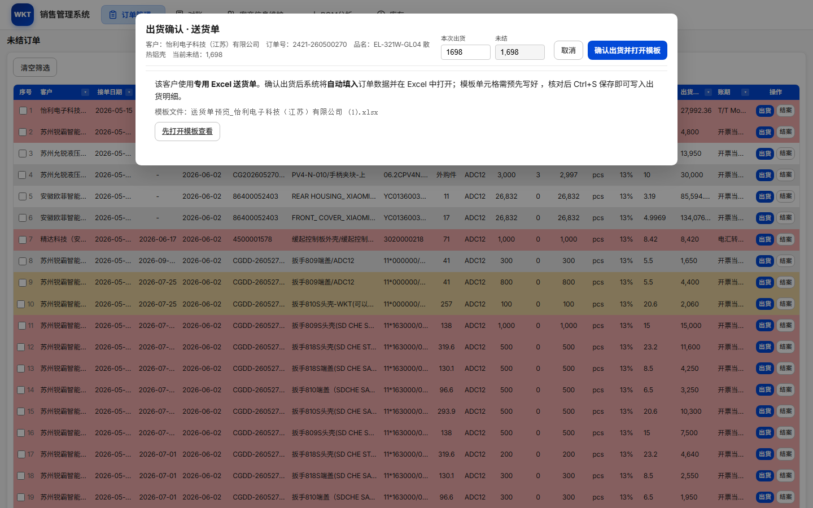

#### 出货后会发生什么

| 变化 | 说明 |
|------|------|
| 已出货 | 增加本次数量 |
| 未结 | 自动 = PO − 已出货 |
| 未结 = 0 | 行从未结消失，进入 **正常结案** |
| 出货明细 | 新增一条出货记录 |
| 成品库存 | 自动扣减（不足则 **无法出货**） |
| 应收 | 按账期计入对应 **收款月** |

⚠️ **注意**

- 出货数量 **不能超过未结**。  
- 成品仓不足时，须先在 **工序出入库** 补成品或检查 BOM/库存。  
- 送货单内容与确认时一致，后续可在 **出货明细** 补打。

---

### 1.7 合并出货（同一客户多料号）

**场景**：同一客户、同一车次，多张 PO 行合并 **一张送货单**。

**步骤 1** · 进入 **未结订单**  
**步骤 2** · 勾选同一客户的 **多条** 行（行首复选框）  
**步骤 3** · 工具栏 **「合并出货（N 条）」** 亮起 → 点击  
**步骤 4** · 在弹窗中逐行填本次出货数量 → 确认  

⚠️ **注意**

- 必须 **同一客户**，否则按钮提示无法合并。  
- 至少 **2 条** 有效数量。

📷 **图 1-8**  
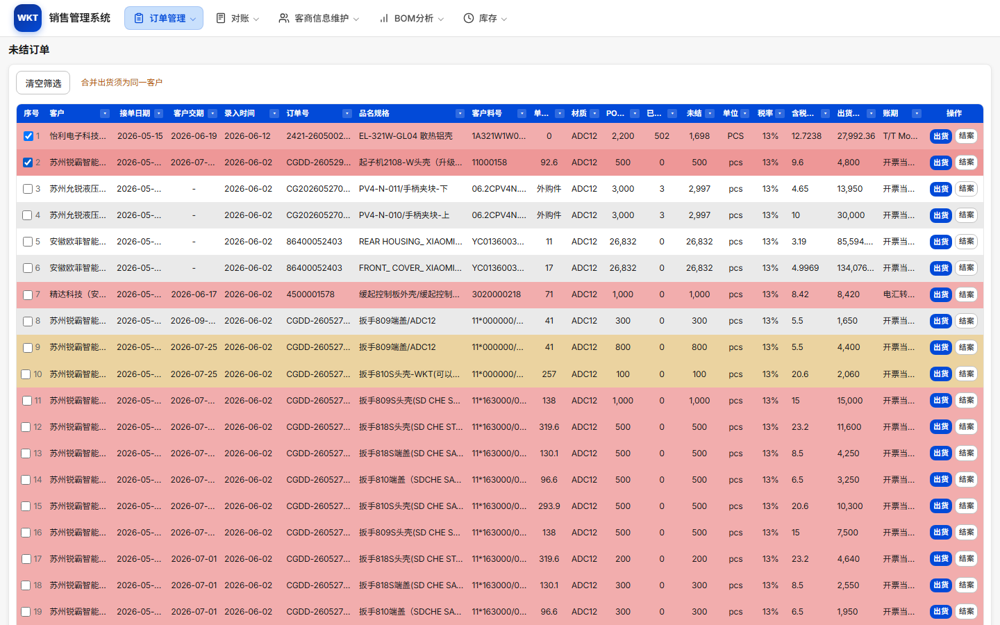

🧪 **练习**：选同一客户 2 个料号做合并出货（测试环境）。

---

### 1.8 出货明细

**进入路径**：**订单管理 ▾ → 出货明细**

每次出货一条记录：出货时间、客户、订单号、料号、**本次出货**、单价、金额、**送货单号** 等。

| 操作 | 说明 |
|------|------|
| **送货单** | 补打/下载与当时确认版一致的送货单 |
| 列筛选 | 按客户、日期、单号筛选 |

📷 **图 1-9**  
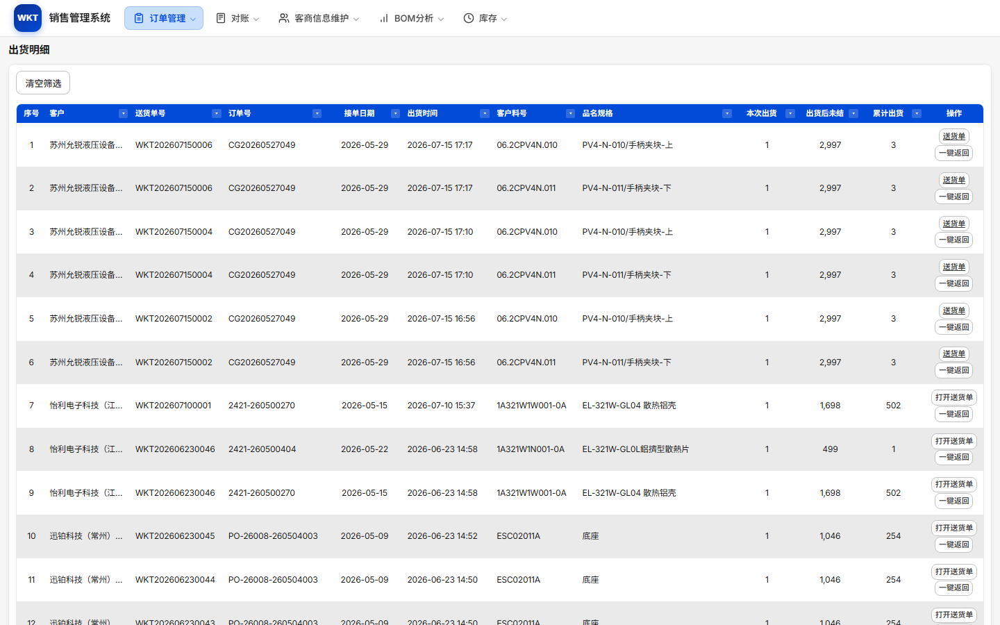

---

### 1.9 正常结案 vs 强制结案

| 类型 | 进入路径 | 含义 |
|------|----------|------|
| **正常结案** | 订单管理 → 正常结案 | 未结 = 0（出完或未结为 0 的导入行） |
| **强制结案** | 订单管理 → 强制结案 | 在未结订单点 **「结案」** 强行关闭 |

⚠️ **强制结案注意**

- **不记出货**、**不生成送货单**  
- **不纳入应收对账**  
- 适用于客户取消、坏账等；须主管确认后再操作  

**步骤（强制）** · 未结订单 → 行末 **结案** → 阅读确认框 → 确定  

📷 **图 1-10**（可选：`force-close.png`）

---

### 1.10 订单模块 · 数据规则速记

| 规则 | 内容 |
|------|------|
| 防重复 | 客户 + 订单号 + 品名规格 唯一 |
| 未结数量 | PO数量 − 已出货（系统自动） |
| 小数位 | 数量 1 位、单重 2 位、单价 4 位、金额 2 位 |
| 列表显示 | 千分位；整数不显示 `.0` |
| 持久化 | 写入 `data/wkt_orders.db`，重启不丢 |

---

## 第 2 章 · 对账（应收 / 应付）

### 2.1 应收 — 客户收款到期

**进入路径**：**对账 ▾ → 应收**

#### 页面打开后看到什么

- 自 **当月** 起连续 **6 个月** 的收款到期汇总（在列表内 **上下滚动** 浏览）  
- 每一段：**月份标题 + 各客户金额 + 段内合计**  
- 工具栏：**近 6 月合计 ¥xxx**

📷 **图 2-1**  
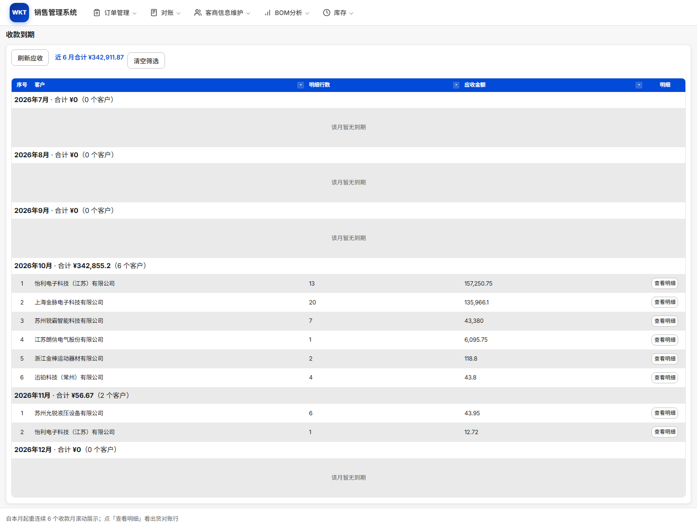

#### 收款月怎么来的

- 依据 **出货日期** + **全局收款账期**（默认常见：**月结 90 天 · 每月 25 日**）  
- 例：7 月出货 → 收款月可能在 **10 月**，故 7～9 月段可能显示「该月暂无到期」—— **属正常**  

💡 **提示**：财务可对照 `data/reconciliation_config.json`（由管理员维护）。

#### 查看某一客户明细

**步骤 1** · 在对应月份段找到客户行  
**步骤 2** · 点 **「查看明细」**  
**步骤 3** · 显示该客户该月所有出货对账行（订单号、料号、出货日、数量、金额等）  
**步骤 4** · 点 **「← 返回汇总」** 回到 6 月视图  

📷 **图 2-2**  
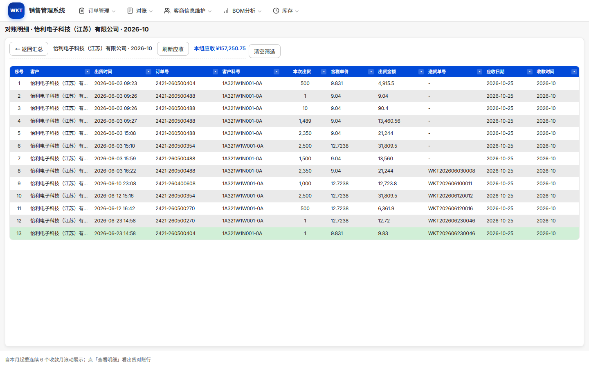

#### 汇总页额外筛选（可选）

工具栏 **收款月份 / 出货月份** 下拉可切换视图（明细模式下显示收货相关筛选项）。

🧪 **练习**：打开应收，滚动找到有数据的月份，钻取 1 个客户明细。

---

### 2.2 应付 — 外协供应商付款到期

**进入路径**：**对账 ▾ → 应付**

#### 数据来源

- **外发回货**：在 **工序出入库** 登记「回货入库」  
- **金额** = 回货数量 × **BOM 中该工序单价**（缺 BOM 价显示「待补BOM」）  
- **结算月**：按 **供应商对账周期**（须在供应商档案维护）  
- **付款月**：按 **供应商账期**  

界面与应收对称：**6 个月滚动 + 查看明细**。

📷 **图 2-3**  
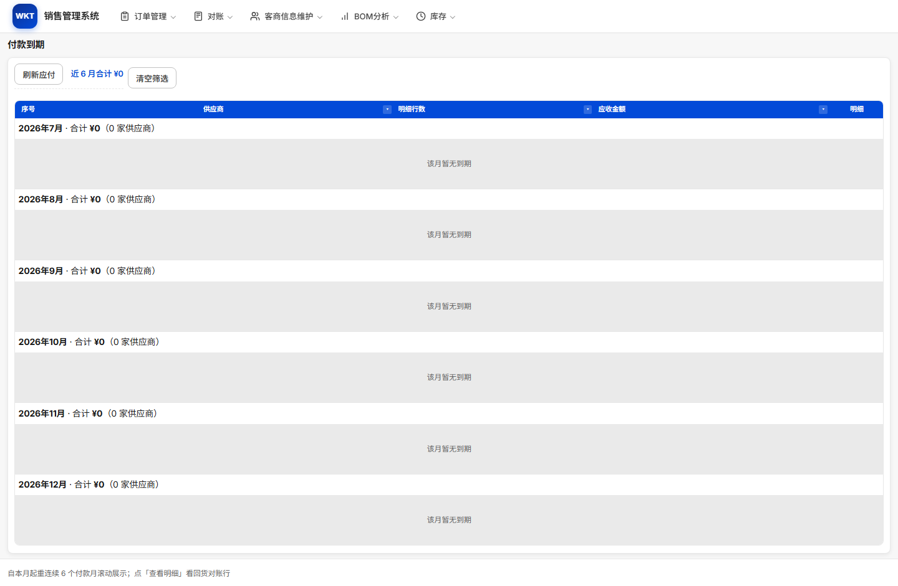

#### 明细页筛选

可填 **收货起 / 收货止** 限定回货日期范围。

⚠️ **注意**

- 供应商 **账期、对账周期** 为空时，应付月可能不准。  
- 回货前须 BOM 有对应 **外发工序单价**。

🧪 **练习**：完成一次外发「发出 → 回货入库」后，在应付中找对应供应商月份。

---

## 第 3 章 · 客商信息维护

### 3.1 客户信息维护

**进入路径**：**客商信息维护 ▾ → 客户信息维护**

#### 为什么要维护

- 出货时自动带 **收货地址、联系人**  
- 生成 **送货单**（威可特统一模板或客户专用 Excel）  
- **账期、对账周期** 供对账参考  

#### 新增客户 — 步骤

**步骤 1** · 上方表单填：客户名称、地址、联系人、电话、邮箱  
**步骤 2** · **账期**：如「月结60天」  
**步骤 3** · **对账周期**（必选）：自然月 / 21～20 / 26～25 等  
**步骤 4** · **送货单**：不使用 / **威可特统一模板** / 专用模板  
**步骤 5** · 点 **「添加客户」**  

#### 一览表维护

| 操作 | 步骤 |
|------|------|
| 改档案 | **编辑** → 改字段 → **保存** |
| 预览送货单 | **预览**（未启用送货单时按钮灰） |
| 删客户 | **删除** → 确认 |

📷 **图 3-1**  
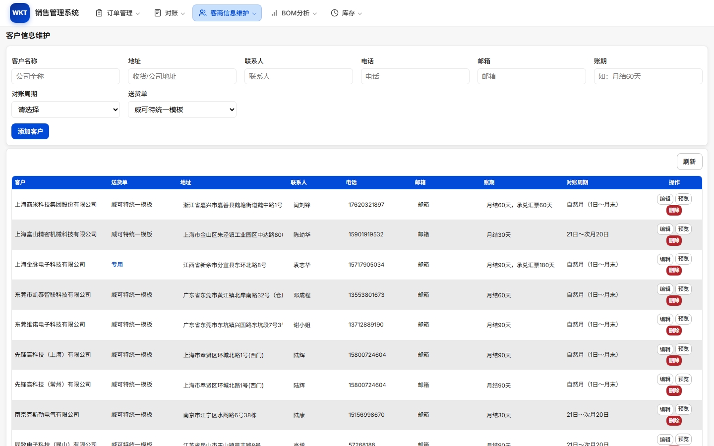

📷 **图 3-2** · 送货单预览  
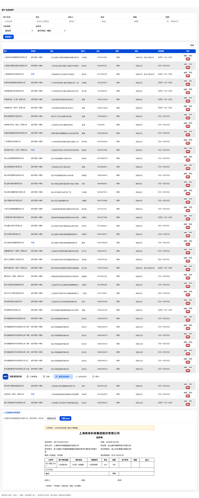

#### 专用 Excel 送货单（进阶）

1. Excel 单元格写占位符：`{{客户}}`、`{{订单号}}`、`{{本次出货}}` 等  
2. 客户选 **专用模板** → 上传 Excel → 保存  
3. **预览** 下载示例核对位置  
4. 出货时系统自动填数并打开 Excel  

⚠️ **注意**

- 订单录入时 **+** 新增的客户名，建议来此 **补全档案**。  
- 对账周期选错会影响内部对账统计，不确定时问财务。

---

### 3.2 供应商信息维护

**进入路径**：**客商信息维护 ▾ → 供应商信息维护**

与客户的区别：**无送货单**，但有 **账期、对账周期**（应付必需）。

**步骤 1** · 上方添加供应商名称、联系方式  
**步骤 2** · 填写 **账期**（如月结30天）  
**步骤 3** · 一览表 **编辑** → 选 **对账周期** → **保存**  

📷 **图 3-3**  
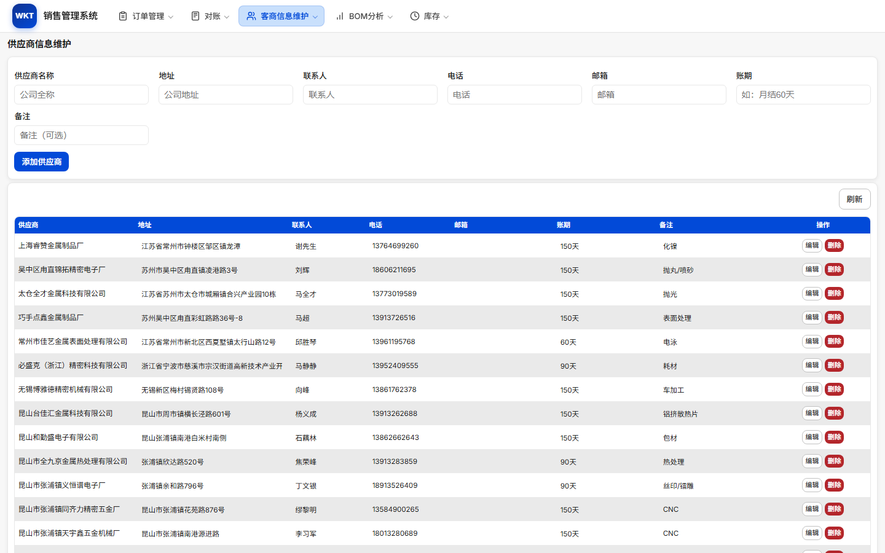

💡 **提示**：BOM 外发工序选的供应商名，应与此处 **完全一致**。

---

## 第 4 章 · BOM 分析

BOM = **客户料号主数据**（模具、单重、材质、工序、成本）。**订单录入认 BOM，不认历史订单。**

### 4.1 BOM 录入

**进入路径**：**BOM分析 → BOM录入**（或 `/bom/entry`）

#### 操作步骤

**步骤 1** · 填 **客户名称**、**产品料号**（= 订单里的客户料号）  
**步骤 2** · 填产品名称、模具编号、模穴、单重、材质、机台吨位  
**步骤 3** · 在 **工序选择** 区勾选本件工艺路线，填写各工序 **单价**；外发工序选 **供应商**  
**步骤 4** · 可选 **「预览成本」** 看汇总  
**步骤 5** · **「提交保存」**  

📷 **图 4-1**  
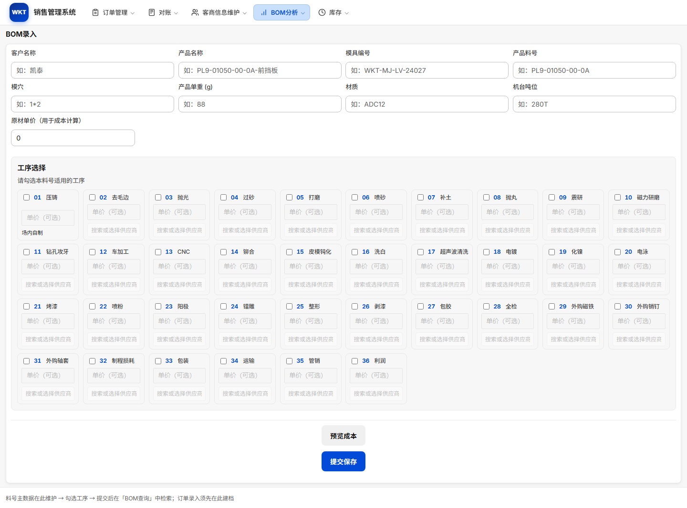

⚠️ **注意**

- 同一 **产品料号** 只能绑定 **一个客户**。  
- 料号已存在时会带出部分字段，改完再保存。  
- **订单录入** 填料号后离开输入框，会自动回填品名/单重/材质。

🧪 **练习**：为新料号完整建 BOM（含至少 1 个外发工序），再回订单录入验证自动回填。

---

### 4.2 BOM 查询

**进入路径**：**BOM分析 → BOM查询**

| 功能 | 操作 |
|------|------|
| 搜索 | 关键字 / 客户 / 料号 → **查询** |
| 修改 | 行末 **编辑** → 改工序或单价 → 保存 |
| 删除 | **删除** → 确认 |

📷 **图 4-2**  
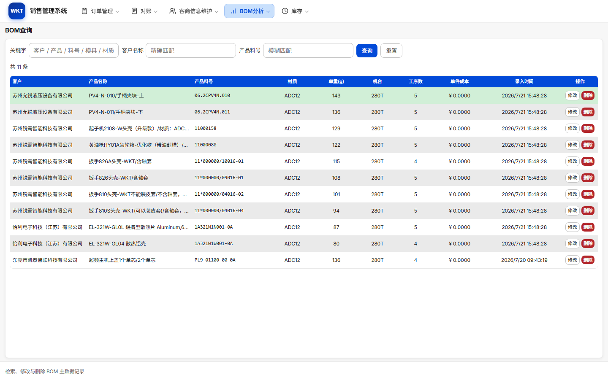

⚠️ **注意**：改 BOM 单价会影响 **之后** 的应付计算，已登记回货不重算历史。

---

## 第 5 章 · 库存

按 BOM 工艺路线管理 **场内 / 在途 / 成品**。料号须先 BOM 建档。

### 5.1 库存总览

**进入路径**：**库存 ▾ → 库存总览**

#### 页面内容

| 区域 | 说明 |
|------|------|
| 料号卡片 | 各工序 **场内 / 在途**；右侧 **成品库存** |
| **测 / 实** | 演示数据标 **测**，正式数据标 **实** |
| **待回货** | 在途 > 0 时工序站提示 |
| 出入库流水 | 历史变动记录 |

**步骤 1** · 可选填料号 → **查询**（留空查全部）  
**步骤 2** · 点 **「出入库登记」** 跳转登记页  

📷 **图 5-1**  
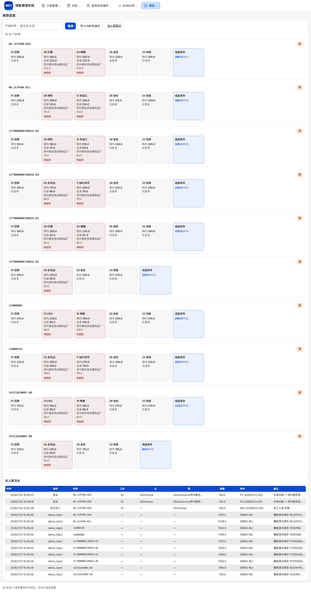

⚠️ **注意**

- **「写入10料号演示」** 仅测试用，数据标 **测**，正式环境勿随意点。  
- **订单出货** 会自动扣成品；此处「成品出货」是 **手工扣库**（非销售出货）。

---

### 5.2 工序出入库

**进入路径**：**库存 ▾ → 工序出入库**

#### 页面分三块

1. **载入区**：输入料号 → **载入工序库存**  
2. **工序站 + 登记动作**（载入后显示）  
3. **当日出入库流水**（**打开即显示今天全部料号**，无需先载入）

📷 **图 5-2**  
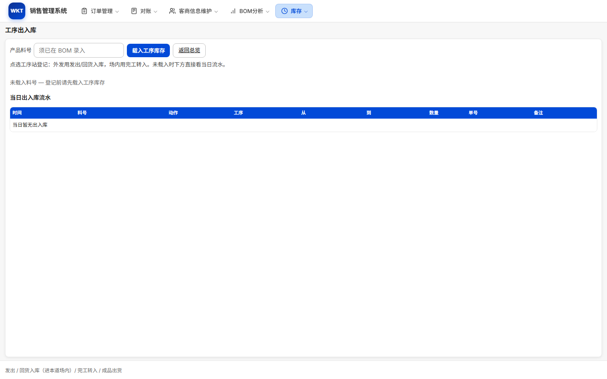

#### 四种动作

| 动作 | 何时用 | 库存变化（简化） |
|------|--------|------------------|
| **完工转入** | 场内工序完成 | 上道场内 ↓ → 本道场内 ↑（首道直接加场内；末道进成品） |
| **发出** | 外发 | 上道场内 ↓ → **本道在途** ↑ |
| **回货入库** | 外协送回 | **本道在途** ↓ → **本道场内** ↑ |
| **成品出货** | 非订单手工出库 | 成品库存 ↓ |

#### 典型外发流程

```
上道工序有场内货
    → 点本道「发出」（供应商、数量）
    → 等回货
    → 点本道「回货入库」
    → 若要发下一道：点下道工序「发出」
```

#### 登记步骤（通用）

**步骤 1** · 输入料号 → **载入工序库存**  
**步骤 2** · **点选** 某一工序站（高亮）  
**步骤 3** · 点动作按钮（如 **发出**）  
**步骤 4** · 看提示「从哪扣 → 到哪增」  
**步骤 5** · 填 **数量**、可选备注 → **提交登记**  
**步骤 6** · 成功提示含单号（如 `FC-20260723-001`），下方流水刷新  

#### 单号规则（自动生成）

| 前缀 | 动作 |
|------|------|
| WG | 完工转入 |
| FC | 发出 |
| RK | 回货入库 |
| CP | 成品出货 |

⚠️ **注意**

- 数量不能超过当前 **场内/在途** 余额，否则提交失败。  
- 外发 **发出** 时供应商来自 BOM；须与 **供应商档案** 一致。  
- **订单出货** 仍走未结订单，与此处 **成品出货** 不同。

🧪 **练习**

1. 打开页面 **不载入料号**，确认能看到 **当日流水**。  
2. 载入一料号：做一次 **发出 + 回货入库**，在总览看 **待回货** 变化。

---

## 第 6 章 · 飞书通知（可选）

由 **管理员** 配置。业务人员了解即可：录入、修改、删除、出货等变动可推送到飞书群。

配置路径：`data/feishu_config.json`（**勿泄露 Webhook**）  
说明：`data/feishu_README.md`

---

## 第 7 章 · 正式测试检查表

> **测试阶段数据**：正式数据在云端。本地请用 **`一键下载云端数据覆盖本地.bat`** 对齐生产；勿清空本地/云端业务库。  
> 库存演示数据可在 **库存总览** 页使用「写入10料号演示」（带 **测** 标注）。

请每位测试人员在完成后打 ✓，有问题记录「现象 + 截图 + 操作步骤」反馈 IT。

### 7.1 基础环境

| # | 任务 | ✓ |
|---|------|---|
| 1 | 能独立启动 bat 并打开网页 | |
| 2 | 知道不能关命令行窗口 | |
| 3 | 页面异常时会 Ctrl+F5 | |

### 7.2 订单

| # | 任务 | ✓ |
|---|------|---|
| 4 | OCR 识别 1 份 PO 并提交 | |
| 5 | 手动录入 1 条 | |
| 6 | 订单明细修改 / 筛选 | |
| 7 | 未结订单出货 1 次 + 送货单 | |
| 8 | 合并出货（可选） | |
| 9 | 在出货明细补打送货单 | |

### 7.3 主数据

| # | 任务 | ✓ |
|---|------|---|
| 10 | 新增 / 编辑客户档案 | |
| 11 | 新增 / 编辑供应商档案 | |
| 12 | BOM 录入 + 查询 | |

### 7.4 库存与对账

| # | 任务 | ✓ |
|---|------|---|
| 13 | 库存总览查看测/实 | |
| 14 | 工序出入库登记 1 次 | |
| 15 | 应收 6 月视图 + 明细钻取 | |
| 16 | 应付（有回货后）查看 | |

### 7.5 问题反馈模板

```
模块：
操作步骤：1… 2… 3…
期望结果：
实际结果：
截图文件名：
测试人 / 日期：
```

---

## 附录

### 附录 A · 岗位速查

| 岗位 | 常用模块 |
|------|----------|
| 销售跟单 | 订单录入、未结、出货明细、客户维护、应收 |
| 仓库 | 库存总览、工序出入库、未结出货 |
| 外协跟单 | 工序出入库（发出/回货）、供应商维护、应付 |
| 工程/成本 | BOM录入、BOM查询 |
| 财务 | 应收、应付、客户/供应商账期 |

### 附录 B · 常见问题

| 现象 | 处理 |
|------|------|
| 网页打不开 | 检查 bat 窗口是否还在；重新启动 |
| 像旧版界面 | **Ctrl + F5** |
| OCR 黄标记 | 对照原件改表格再提交 |
| 保存提示料号未建档 | 先去 **BOM录入** |
| 出货失败成品不足 | 检查库存总览成品数；补登记或等生产入库 |
| 应收某月为空 | 看收款账期是否把货期推到后面月份 |
| 应付「待补BOM」 | BOM 补该工序单价 |
| 数据会丢吗 | 正常关 bat 前已保存的数据在 db 里；**勿删 wkt_orders.db** |

### 附录 C · 名词解释

| 名词 | 含义 |
|------|------|
| 料号 / 客户料号 | 客户物料编码，BOM 主键 |
| 未结 | PO数量 − 已出货 |
| 场内 / 在途 | 本厂仓库 vs 发外协途中 |
| 收款月 / 付款月 | 按账期算出的应结月份 |
| 测 / 实 | 库存数据为演示测试或正式业务 |

### 附录 D · 相关文档

| 文档 | 路径 |
|------|------|
| 简明操作 SOP | `docs/SOP/系统操作SOP.md` |
| [`员工培训手册-图文版.pdf`](./员工培训手册-图文版.pdf) | PDF 打印版（`python scripts/export_sop_pdf.py` 重新生成） |
| 数据结构（IT） | `docs/architecture/data-model.md` |
| 版本与回退（IT） | `docs/VERSION.md`、`docs/RESTORE.md` |

---

*手册版本：v1.0 · 2026-07-23 · CL-0130 · 配图由实施同事按 `images/README.md` 补充*
