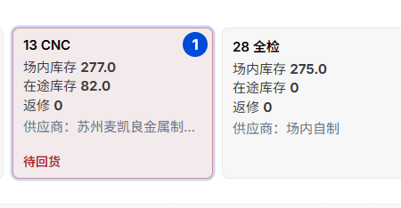
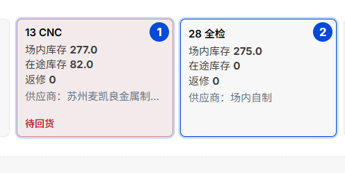

# 工序出入库 · 操作说明

> **一句话**：点选 1～2 道工序，点「编辑」改库存或登记流转。

**入口**：顶部 **库存 → 工序出入库** → 输入产品料号并加载。

---

## 步骤 1 · 点选工序

- 点 **1 道**：改该工序的场内 / 在途 / 返修数量  
- 按顺序点 **2 道**：登记两道工序之间的流转（① 流出 → ② 流入）

---

## 步骤 2 · 编辑并保存

选中后点 **「编辑」**，填写数量；**供应商必填**（可搜索）。单道改数点保存；双道流转分别填流出、流入数量与状态后保存。

---

## 补充说明

| 项目 | 说明 |
|------|------|
| 供应商 | 每道工序卡片上均显示；保存时同步到 BOM |
| 流水单号 | 自动生成，格式 `WKT年月日001`（如 WKT20260729001） |
| 备注 | 工序记录备注仅记录供应商信息 |
| 成品 | 可单独点「成品库存」卡片编辑 |

威可特 WKT 销售管理系统 · 2026-07-29
