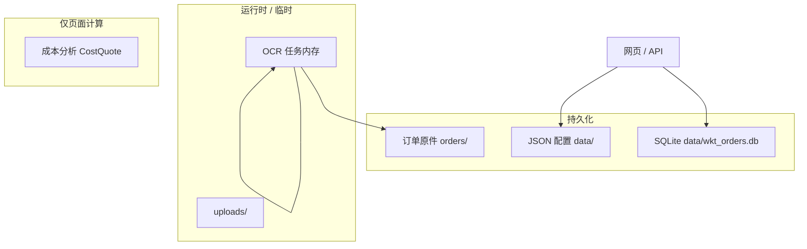
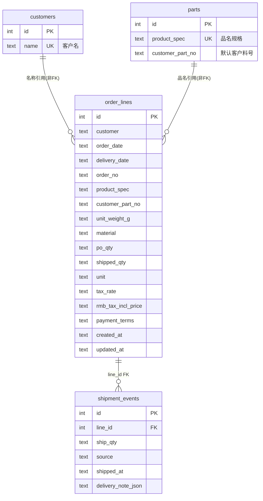
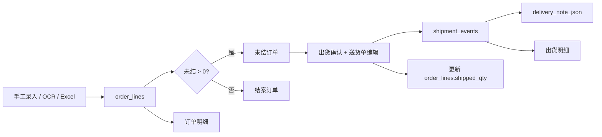

# WKT 销售管理系统 · 数据结构说明

> 描述业务数据如何存储、关联与流转。  
> 代码对照：`test_impl/order_management/order_entry/line_store.py`（SQLite 建表）、`line_models.py`、`shipment_models.py`。  
> 最后更新：2026-05-30 · CL-0059

---

## 1. 数据存放总览

| 类型 | 路径 | 说明 |
|------|------|------|
| **订单主库** | `data/wkt_orders.db` | SQLite，核心业务数据 |
| **JSON 配置** | `data/delivery_templates/`、`data/feishu_config.json` | 送货单抬头、客户收货信息、飞书 Webhook |
| **订单原件** | `orders/{客户名}/{接单日期}_{订单号}.ext` | OCR 识别后归档的 PDF/图片 |
| **上传临时** | `test_impl/web/uploads/` | 上传中间文件，可清理 |
| **OCR 任务** | 内存（`app.py`） | `_recognize_jobs`、`_recognize_previews`，重启清空 |
| **成本分析** | 不入库 | 浏览器内 `CostQuote` 计算 |



---

## 2. SQLite 实体关系

库文件默认路径：`P:\WKT\data\wkt_orders.db`（可通过环境变量 `WKT_DB_PATH` 覆盖）。



**说明**

- `customers`、`parts` 为录入辅助主数据；`order_lines` 存的是文本副本，**无外键**约束。
- `shipment_events.line_id` → `order_lines.id` 为唯一正式外键。
- 数值在 SQLite 中多以 **TEXT** 存储（如 `po_qty`），应用层用 `Decimal` 解析。

---

## 3. 业务唯一性

逻辑唯一键（应用层校验，非数据库 UNIQUE 索引）：

**客户 + 订单号 + 品名规格**

重复新建返回 HTTP 409，响应含 `duplicate_id`。实现见 `line_store.find_duplicate_line()`。

---

## 4. 表 `order_lines`（一料号一行）

对应网页列表一行、附件 2 的 15 列业务字段 + 系统字段。

| 字段 | 类型/存储 | 说明 |
|------|-----------|------|
| `id` | INTEGER PK | 自增主键 |
| `customer` | TEXT | 客户 |
| `order_date` | TEXT | 接单日期 |
| `delivery_date` | TEXT | 客户交期 |
| `order_no` | TEXT | 订单号 |
| `product_spec` | TEXT | 品名规格 |
| `customer_part_no` | TEXT | 客户料号 |
| `unit_weight_g` | TEXT | 单重(g)；可为数字或备注如「外购件」 |
| `material` | TEXT | 材质 |
| `po_qty` | TEXT → Decimal | PO 数量 |
| `shipped_qty` | TEXT → Decimal | 已出货，默认 0 |
| `unit` | TEXT | 单位 |
| `tax_rate` | TEXT → Decimal | 税率 0~1（如 0.13） |
| `rmb_tax_incl_price` | TEXT → Decimal | 人民币含税单价 |
| `payment_terms` | TEXT | 账期 |
| `closure_type` | TEXT | 结案方式：空=未强制结案；`forced`=强制结案（不记出货、不纳入对账） |
| `created_at` | TEXT ISO | 系统录入时间 |
| `updated_at` | TEXT ISO | 最后更新时间 |

### 计算字段（不存表）

| 字段 | 公式 | 精度 |
|------|------|------|
| `open_qty` 未结 | `po_qty − shipped_qty` | 数量 1 位小数 |
| `amount` 含税金额 | `po_qty × rmb_tax_incl_price` | 金额 2 位小数 |

Python 模型：`OrderLine`（`line_models.py`）。

### API JSON 示例（`GET /api/lines`）

```json
{
  "id": 1,
  "customer": "怡利",
  "order_date": "2026-05-01",
  "delivery_date": "2026-06-01",
  "order_no": "PO-001",
  "product_spec": "某某散热器",
  "customer_part_no": "YL-123",
  "unit_weight_g": "12.5",
  "material": "ADC12",
  "po_qty": "1000",
  "shipped_qty": "200",
  "open_qty": "800",
  "unit": "PCS",
  "tax_rate": "0.13",
  "rmb_tax_incl_price": "3.5000",
  "amount": "3500.00",
  "payment_terms": "月结30天",
  "created_at": "2026-05-30T08:00:00+00:00",
  "updated_at": "2026-05-30T08:00:00+00:00"
}
```

结案订单（`view=closed`）在上述字段基础上增加：

```json
{
  "last_shipped_at": "2026-05-30T14:30:00+00:00",
  "last_delivery_doc_no": "WKT202605300003"
}
```

无出货登记记录时两字段为空字符串。

### 列表视图与数据关系

| 子模块 | 数据条件 |
|--------|----------|
| 订单明细 | 全部 `order_lines` |
| 未结订单 | `open_qty > 0` 且非强制结案；可出货、合并出货或 **强制结案**（`POST /api/lines/{id}/force-close`） |
| 正常结案订单 | `open_qty ≤ 0` 且 `closure_type ≠ forced`；按最后一次出货时间降序；附带 `last_shipped_at`、`last_delivery_doc_no` |
| 强制结案订单 | `closure_type = forced`；不记出货、不纳入对账；按 `updated_at` 降序 |
| 出货明细 | 仅 `shipment_events`（不含录入时直接填的「已出货」） |

---

## 5. 表 `shipment_events`（出货事件）

每次「未结 → 出货」登记产生一条记录；历史 Excel 导入出货（`source=import`）亦在此表。

| 字段 | 说明 |
|------|------|
| `id` | 主键；送货单打印 URL 使用此 ID |
| `line_id` | 关联 `order_lines.id` |
| `ship_qty` | 本次出货数量 |
| `source` | `open_ship`（未结出货）或 `import`（历史导入） |
| `shipped_at` | 出货时间（ISO 文本） |
| `delivery_note_json` | 确认出货时送货单完整 JSON 快照 |

出货明细 API 会 JOIN `order_lines`，并附带快照时刻的：

- `shipped_qty_after` — 该行累计已出货
- `open_qty_after` — 出货后未结（`po_qty − shipped_qty_after`）

Python 模型：`ShipmentEvent`（`shipment_models.py`）。

### API JSON 示例（`GET /api/shipment-events`）

```json
{
  "id": 12,
  "line_id": 1,
  "ship_qty": "100",
  "source": "open_ship",
  "source_label": "未结出货",
  "shipped_at": "2026-05-30T10:00:00+00:00",
  "customer": "怡利",
  "order_date": "2026-05-01",
  "order_no": "PO-001",
  "product_spec": "某某散热器",
  "customer_part_no": "YL-123",
  "po_qty": "1000",
  "shipped_qty_after": "300",
  "open_qty_after": "700"
}
```

---

## 6. 送货单快照 `delivery_note_json`

结构对应 `WktDeliveryDocument`（`delivery_note/wkt_document.py`），确认出货时写入 `shipment_events.delivery_note_json`。

```
WktDeliveryDocument
├── title_company          抬头公司名
├── doc_no                 送货单号（格式见下）
├── ship_date_cn           出货日期（中文格式）
├── receiver_company       收货公司
├── receiver_address       收货地点
├── receiver_contact       收货联系人
├── supplier_name          供应商名称
├── supplier_address       供应商地址
├── supplier_phone         供应商电话
├── lines[]                明细行 WktDeliveryLine
│   ├── order_no           订单号
│   ├── customer_part_no   客户料号
│   ├── product_name       品名
│   ├── spec               规格
│   ├── unit               单位
│   ├── qty                数量
│   ├── batch_no           批号
│   ├── box_count          箱数
│   └── remark             备注
├── total_qty              合计数量
├── footer_note            页脚说明
├── deliverer              送货人
├── warehouse_manager      仓管
├── receiver_sign          收货签收
└── is_sample              是否样品
```

抬头默认值来自 `data/delivery_templates/wkt_company.json`；客户收货信息来自 `customer_delivery.json`。

**送货单号 `doc_no` 规则**（`wkt_document._gen_doc_no`）：

- 格式：`{前缀}{YYYYMMDD}{当月序号4位}`，如 `WKT202605300001`。
- 前缀：客户维护的 `doc_no_prefix`（如 `ABL`），否则全公司默认 `WKT`。
- 末 4 位为**自然月**内出货序号：每月 1 日（本地时区）归零后，按 `shipment_events` 登记顺序从 `0001` 递增。
- 草稿预览未确认前末位为 `01`；确认出货后写入正式序号。

---

## 7. 主数据表

### `customers`

| 字段 | 说明 |
|------|------|
| `id` | PK |
| `name` | 客户名，UNIQUE |

录入 / OCR 时自动 `INSERT OR IGNORE`；用于手工录入客户下拉。

### `parts`

| 字段 | 说明 |
|------|------|
| `id` | PK |
| `product_spec` | 品名规格，UNIQUE |
| `customer_part_no` | 对应客户料号 |

选品名时可自动带出客户料号（`GET /api/master/lookup`）。

---

## 8. JSON 配置文件

| 文件 | 用途 |
|------|------|
| `data/delivery_templates/wkt_company.json` | 威可特供应商信息、`doc_no_prefix`（如 WKT） |
| `data/delivery_templates/customer_delivery.json` | 按客户：收货地址、联系人、单号前缀 |
| `data/delivery_templates/mapping.json` | 客户名 → 旧 Excel 模板文件名（遗留） |
| `data/feishu_config.json` | 飞书 Webhook（**勿提交 Git**） |

`customer_delivery.json` 示例：

```json
{
  "怡利": {
    "receiver_company": "",
    "receiver_address": "江苏省苏州市吴江经济开发区锦湖西路167号",
    "receiver_contact": "",
    "doc_no_prefix": ""
  }
}
```

---

## 9. 订单原件归档

路径规则（`order_archive.py`）：

```
orders/
└── {客户名}/
    └── {接单日期}_{订单号}.pdf
```

- 客户名、日期、订单号来自 OCR 识别结果第一行。
- 非法路径字符替换为 `_`；重名文件自动加 `_2`、`_3` …
- 归档失败不阻断 OCR 识别流程。

---

## 10. 不入库 / 临时数据

| 数据 | 位置 | 说明 |
|------|------|------|
| OCR 识别任务 | `app.py` `_recognize_jobs` | 进度、结果；重启丢失 |
| PDF 预览页 PNG | `_recognize_previews` | 200 DPI 渲染缓存；重启丢失 |
| 成本报价 | `cost_analysis/models.py` `CostQuote` | 原材 + 工艺单价，仅前端会话 |
| Excel 导入预览 | 前端 `excelImportPreview` | 解析后待确认，未提交前不入库 |

---

## 11. 业务流程（数据流）



**出货时同步更新**

1. `order_lines.shipped_qty` += 本次数量  
2. 插入 `shipment_events`（含 `delivery_note_json`）  
3. 若未结变为 0，该行从未结列表消失，进入结案列表  

---

## 12. 小数与展示口径

| 项目 | 存储/计算精度 | 说明 |
|------|---------------|------|
| 数量 `po_qty`、`shipped_qty` | 1 位小数 | `round_qty` |
| 单重 | 2 位或原文 | 允许非数字备注 |
| 含税单价 | 4 位小数 | `round_price` |
| 金额 | 2 位小数 | `round_amount` |
| 税率 | 0~1 | 录入可写 `13%`，归一化为 0.13 |

详见 `docs/change/money-format-v1.md`。

---

## 13. 维护与排查

| 操作 | 命令 / 路径 |
|------|-------------|
| 查看库路径 | `GET /api/health` → `db_path` |
| 清空重来 | `scripts\reset_order_db.ps1` |
| 表结构源码 | `line_store.py` → `_SCHEMA`、`_migrate_schema` |
| 代码符号索引 | CodeGraph：`codegraph query OrderLine` |

### 文档同步（强制）

凡修改 **SQLite 表**、**持久化字段**、**API 返回字段**、**送货单 `delivery_note_json` 结构** 时，**同一变更**内必须更新本文档（ER 图、字段表、JSON 示例、数据流图），并登记 CHANGELOG。  
纯 UI / 不改结构的逻辑：无需改本文档。  
Agent 规则见 `.cursor/rules/wkt-agent-workflow.mdc` 与 `AGENTS.md` 合规清单。
